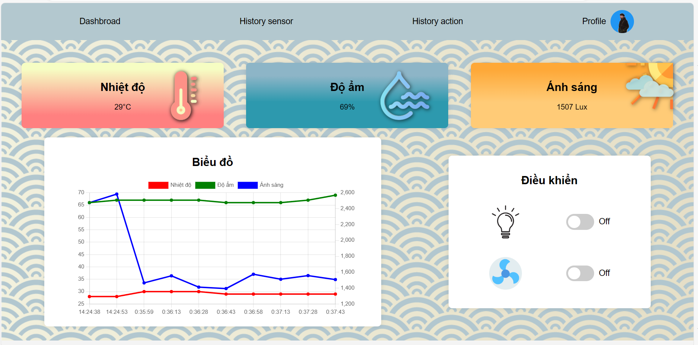
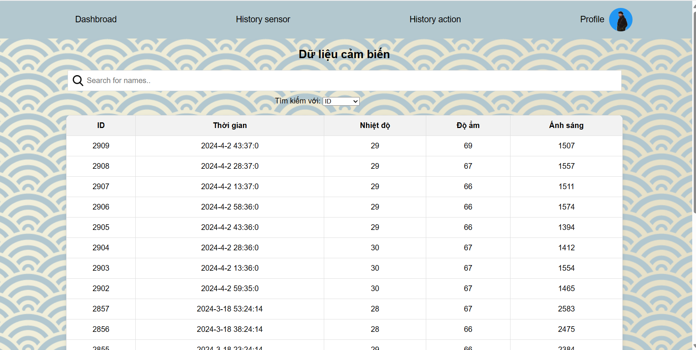
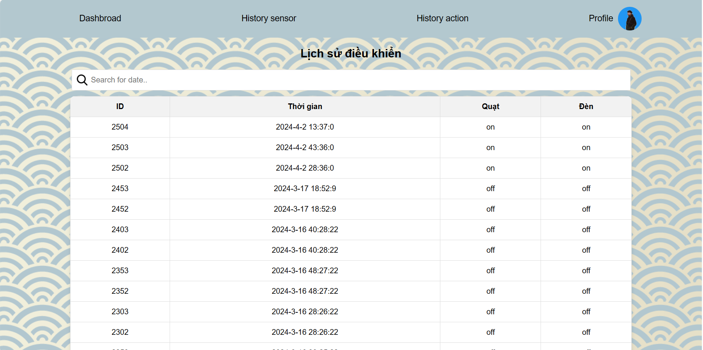
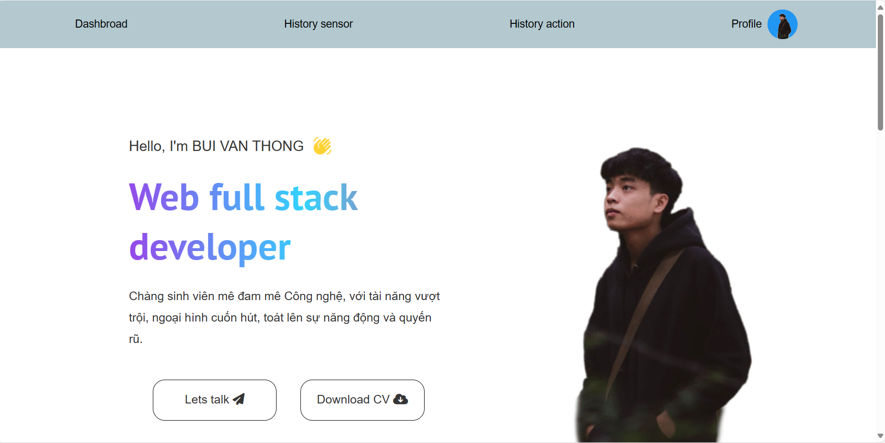
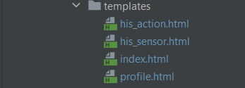

 ## IOT Web Application

This is my IOT web application built with HTML, CSS and JavaScript for Front-end side. For the server side, I use Spring Boost and MySQL.

## Installation

Download this repo, extract and open it in Intellij. Open the terminal and type:

install JDK 11 : https://www.oracle.com/java/technologies/javase/jdk11-archive-downloads.html

Dowload Intellij in  : https://www.jetbrains.com/idea/download/other.html.

Dowload Maven in: https://maven.apache.org/download.cgi.

Dowload mySQl in : https://dev.mysql.com/downloads/installer/

After that, it will install all the packages you need to run this application.

## UI web


  1. Dashboard
    
  2. Data Sensor page.
    
  3. History Action
    
  4. Profile
    .
     5. Cấu trúc thư mục UI.
    
    
## Database Configuration

You need create database called "iot" and 2 tables: "sensor" (id, date, temp, lux,hum) and "control" (id,date,fan, light).

After that, you must connect your server with database, go into "aplication.properties" file, change your database configuration:

```bash
spring.jpa.hibernate.ddl-auto=update
spring.datasource.url=jdbc:mysql://${MYSQL_HOST:localhost}:3306/iot
spring.datasource.username=<<your_username>>
spring.datasource.password=<<yourpass_word>>
spring.datasource.driver-class-name=com.mysql.cj.jdbc.Driver
#spring.jpa.show-sql: true
```
<<your_username>> type your usename database.

<<yourpass_word>> type your password database.

## MQTT Configuration

You also need to config MQTTBeans.java client, change your option in mqtt connect fuction:


``` java
    public MqttPahoClientFactory mqttPahoClientFactory(){
        DefaultMqttPahoClientFactory factory = new DefaultMqttPahoClientFactory();
        MqttConnectOptions options = new MqttConnectOptions();
        options.setServerURIs(new String[] {
                "tcp://localhost:{<<Your_Port>>}"
        });
        options.setUserName({Your_UserName});
        options.setPassword({Your_Password}.toCharArray());
        options.setCleanSession(true);
        factory.setConnectionOptions(options);
        return factory;
    }
```
<<Your_Port>> type your port you used in mqtt broker.

{Your_UserName} type your usename in mqtt.

{Your_Password} type your password in mqtt .


## Install Arduino

[Download Arduino here!](https://www.arduino.cc/en/software/).
[Installation guide](https://www.thegioididong.com/game-app/cach-tai-va-cai-dat-arduino-ide-nhanh-de-dang-1321845)
[Turn LED with ESP32](https://www.instructables.com/Blinking-an-LED-With-ESP32/)
[DHT 11 sensor with ESP32](https://randomnerdtutorials.com/esp32-dht11-dht22-temperature-humidity-sensor-arduino-ide/)
[Photoregister with ESP32](https://www.youtube.com/watch?v=0t-e2Dmz5TI)

```cpp
const char *ssid = "<YOUR_WIFI_SSID>";
const char *password = "<YOUR WIFI PASSWORD>";
const char *mqtt_broker = "<YOUR HOST>";
const char *topic = "control";
const char *topicStatus = "respondcontrol";
const char *topicSensor = "sensor";
const char *mqtt_username = "<YOUR MQTT USERNAME>";
const char *mqtt_password = "<YOUR MQTT PASSWORD>";
const int mqtt_port = <YOUR MQTT PORT NUMBER>;
```

Open file "sketch_feb1a.ino" and change your network id, network password, mqtt host broker, mqtt username, mqtt password and mqtt port number.

## API Documentations

[API Docs](https://documenter.getpostman.com/view/27000972/2sA35HWfbb)